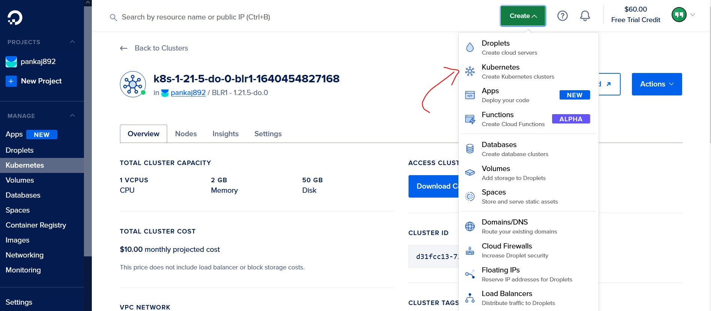
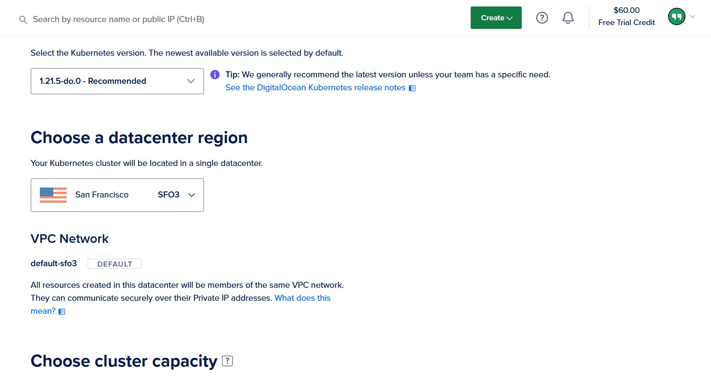
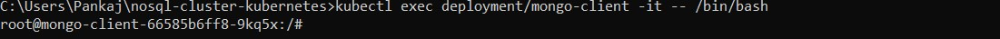
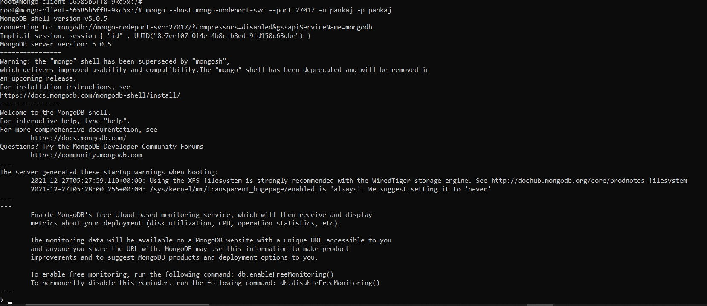
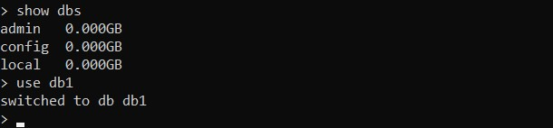

# NoSql MongoDB Cluster using Kubernetes on Digital Ocean

## Getting Started

- Start by creating a kubernetes cluster on Digital Ocean



- Fill the details and cluster will be created for you



``` Before using MongoDB make sure you have doctl and kubectl setup so you can apply the changes to created cluster locally ```

## Deploying to MongoDB

```bash
git clone https://github.com/pankaj892/nosql-cluster-kubernetes/
cd nosql-cluster-kubernetes/
```

### Once you are in the folder Enter the following command

```bash
kubectl apply -f .
```


### Wait for few minutes and to see all deployments use the command

```bash
kubectl get all 
```
### Depending on your cluster location and proximity to your location it may take a few minutes to show up everything as ready


### Now to enter the bash shell of MongoDB client
### Type the following command
```bash 
kubectl exec deployment/mongo-client -it -- /bin/bash
```



> note: make sure to change the credentials in the 'mongodb-secrets.yaml' file

### We can access our mongodb shell via nodeport

```bash
mongo --host mongo-nodeport-svc --port 27017 -u pankaj -p pankaj
```





## Success

### We have successfully logged into our mongodb shell using kubernetes and can perform operations



